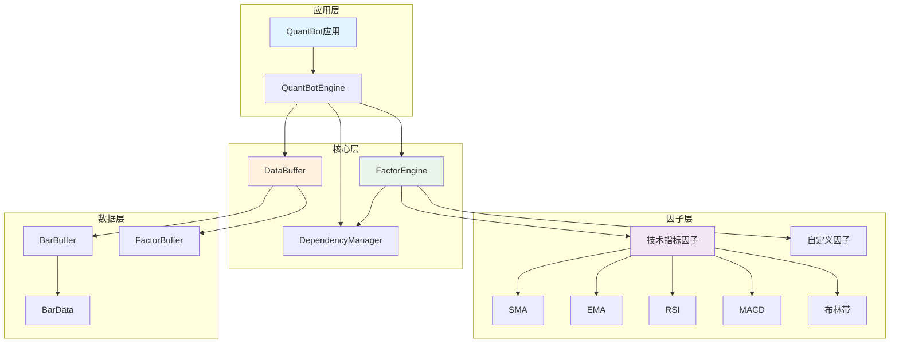
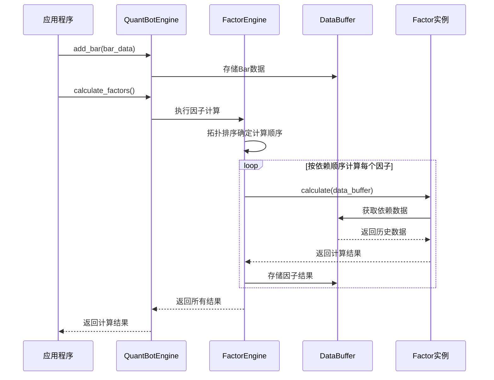
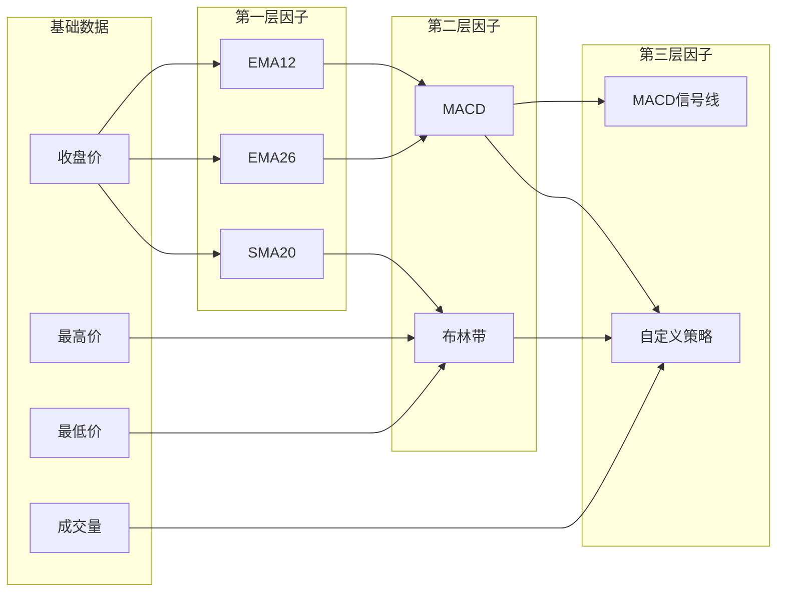

# QuantBot - 高性能量化因子计算库

<div align="center">

**🚀 支持强大因子依赖关系的现代化量化分析框架**

[](https://python.org)
[](https://numpy.org)
[](https://ta-lib.org)

</div>

---

## 📖 目录

- [📊 项目概述](#-项目概述)
- [🏗️ 架构设计](#️-架构设计)
- [✨ 核心特性](#-核心特性)
- [🚀 快速开始](#-快速开始)
- [📈 技术指标库](#-技术指标库)
- [🔧 高级用法](#-高级用法)
- [⚡ 性能优化](#-性能优化)
- [📚 API 文档](#-api-文档)
- [🎯 最佳实践](#-最佳实践)
- [📁 项目结构](#-项目结构)

---

## 📊 项目概述

QuantBot 是一个专为量化交易设计的高性能回测框架，具备强大的因子依赖关系管理能力。框架支持创建复杂的多层依赖因子，系统会自动处理依赖关系的拓扑排序和分层计算，确保因子按正确的顺序高效计算。

### 🎯 核心优势

- **🔗 智能依赖管理**: 自动解析和排序复杂的因子依赖关系
- **⚡ 高效缓存机制**: 基于 NumPy 的循环队列缓存系统
- **🚄 增量计算**: 支持实时数据流的增量处理
- **🎛️ 灵活架构**: 模块化设计，易于扩展新的技术指标
- **📊 丰富指标库**: 内置多种经典技术分析指标

---

## 🏗️ 架构设计

### 系统架构图



### 数据流程图



### 核心组件详解

| 组件 | 职责 | 核心功能 |
|------|------|----------|
| **QuantBotEngine** | 主引擎 | 统一接口、错误处理、性能监控 |
| **FactorEngine** | 因子计算引擎 | 因子注册、拓扑排序、计算调度 |
| **DependencyManager** | 依赖管理器 | 依赖关系解析、循环检测、拓扑排序 |
| **DataBuffer** | 数据缓存 | 统一数据管理、循环队列缓存 |
| **Factor基类** | 因子抽象 | 定义计算接口、依赖声明 |

---

## ✨ 核心特性

### 🔗 因子依赖管理



### ⚡ 高效缓存系统

- **循环队列设计**: 避免频繁内存分配和数据拷贝
- **分层缓存**: Bar数据缓存 + 因子结果缓存
- **智能更新**: 只计算需要更新的因子，支持增量计算

### 🚄 并行计算支持

- **分层并行**: 同层因子可并行计算，不同层按依赖顺序执行
- **智能调度**: 自动识别可并行的因子组合
- **性能监控**: 实时统计计算性能和资源使用

---

## 🚀 快速开始

### 环境准备

```bash
# 激活Python环境
conda activate py310

# 安装依赖
pip install -r requirements.txt
```

### 基础使用示例

```python
from quantbot import QuantBotEngine, BarData
from quantbot.factors.technical import SMA, EMA, RSI, MACD
from datetime import datetime

# 1. 创建引擎
engine = QuantBotEngine(buffer_size=1000)

# 2. 注册技术指标因子
engine.register_factor(SMA(5, 'sma_5_close'))           # 5日简单移动平均
engine.register_factor(EMA(12, 'ema_12_close'))         # 12日指数移动平均  
engine.register_factor(RSI(14, 'rsi_14_close'))         # 14日相对强弱指标
engine.register_factor(MACD(12, 26, 9, 'macd_12_26_9')) # MACD指标

# 3. 添加市场数据
bar = BarData(
    timestamp=datetime.now(),
    open_price=100.0,
    high=105.0,
    low=95.0,
    close=102.0,
    volume=1000.0,
    amount=102000.0
)
engine.add_bar(bar)

# 4. 计算因子
results = engine.calculate_factors()
print("计算结果:", results)

# 5. 获取特定因子值
sma_value = engine.get_factor_value('sma_5_close', 1)
print(f"SMA(5)最新值: {sma_value[0]:.4f}")
```

### 多输出因子示例

```python
from quantbot.factors.technical import BollingerBands, STOCH

# 布林带 (3个输出: 上轨/中轨/下轨)
bb = BollingerBands(20, 2.0, 'bb_20_2')
engine.register_factor(bb)

# 随机指标 (2个输出: %K/%D)  
stoch = STOCH(14, 3, 3, 'stoch_14_3_3')
engine.register_factor(stoch)

# 计算后获取多个输出
results = engine.calculate_factors()

# 获取布林带各条线
bb_upper = engine.get_factor_value('bb_20_2', 1, 'upper')[0]
bb_middle = engine.get_factor_value('bb_20_2', 1, 'middle')[0] 
bb_lower = engine.get_factor_value('bb_20_2', 1, 'lower')[0]

print(f"布林带 - 上轨: {bb_upper:.2f}, 中轨: {bb_middle:.2f}, 下轨: {bb_lower:.2f}")
```

---

## 📈 技术指标库

### 🔄 移动平均类

| 指标 | 类名 | 参数 | 输出 | 说明 |
|------|------|------|------|------|
| **简单移动平均** | `SMA` | `period` | `default` | 算术平均值，平滑价格波动 |
| **指数移动平均** | `EMA` | `period` | `default` | 对近期数据给予更高权重 |

```python
# 移动平均线组合
sma_short = SMA(5, 'sma_5')    # 短期趋势
sma_long = SMA(20, 'sma_20')   # 长期趋势
ema_fast = EMA(12, 'ema_12')   # 快速响应
```

### 📊 动量指标

| 指标 | 类名 | 参数 | 输出 | 说明 |
|------|------|------|------|------|
| **相对强弱指标** | `RSI` | `period` | `default` | 衡量价格动量，范围0-100 |
| **随机指标** | `STOCH` | `k_period, k_slowing, d_period` | `k, d` | %K和%D两条线，超买超卖信号 |

```python
# 动量指标组合
rsi = RSI(14, 'rsi_14')                    # 经典14日RSI
stoch = STOCH(14, 3, 3, 'stoch_14_3_3')    # 随机指标KD
```

### 📈 趋势指标

| 指标 | 类名 | 参数 | 输出 | 说明 |
|------|------|------|------|------|
| **MACD** | `MACD` | `fast, slow, signal` | `macd, signal, histogram` | 趋势跟踪，包含DIF、DEA、柱状图 |
| **布林带** | `BollingerBands` | `period, std_dev` | `upper, middle, lower` | 价格通道，支撑阻力位 |

```python
# 趋势分析指标
macd = MACD(12, 26, 9, 'macd_classic')     # 经典MACD参数
bb = BollingerBands(20, 2.0, 'bb_20_2')    # 20日布林带，2倍标准差
```

### 💹 波动率指标

| 指标 | 类名 | 参数 | 输出 | 说明 |
|------|------|------|------|------|
| **平均真实波幅** | `ATR` | `period` | `default` | 衡量价格波动幅度 |

### 📉 成交量指标

| 指标 | 类名 | 参数 | 输出 | 说明 |
|------|------|------|------|------|
| **能量潮** | `OBV` | 无 | `default` | 成交量与价格关系，资金流向 |

```python
# 波动率和成交量指标
atr = ATR(14, 'atr_14')      # 14日平均真实波幅
obv = OBV('obv')             # 能量潮指标
```

---

## 🔧 高级用法

### 自定义因子开发

```python
from quantbot.core.factor import Factor
import numpy as np

class PriceVolumeCorrelation(Factor):
    """价格成交量相关性因子"""
    
    def __init__(self, period: int, name: str):
        self.period = period
        # 声明依赖的基础数据字段
        dependencies = ['close', 'volume']
        # 声明输出名称
        super().__init__(name, dependencies, output_names=['correlation'])
    
    def calculate(self, data_buffer) -> dict:
        """计算价格与成交量的相关性"""
        # 获取历史数据
        closes = data_buffer.get_bar_field('close', self.period)
        volumes = data_buffer.get_bar_field('volume', self.period)
        
        if len(closes) < self.period:
            return {'correlation': np.nan}
        
        # 计算相关系数
        correlation = np.corrcoef(closes, volumes)[0, 1]
        return {'correlation': float(correlation)}

# 注册并使用自定义因子
custom_factor = PriceVolumeCorrelation(20, 'pv_corr_20')
engine.register_factor(custom_factor)
```

### 复杂依赖链构建

```python
# 构建多层依赖的因子链
# 基础层: EMA指标
ema_12 = EMA(12, 'ema_12_close')
ema_26 = EMA(26, 'ema_26_close')

# 第二层: 基于EMA的MACD
macd = MACD(12, 26, 9, 'macd_12_26_9', dependencies=['ema_12_close', 'ema_26_close'])

# 第三层: 基于MACD的自定义策略因子
class MACDStrategy(Factor):
    def __init__(self):
        super().__init__('macd_strategy', 
                        dependencies=['macd_12_26_9_macd', 'macd_12_26_9_signal'],
                        output_names=['signal'])
    
    def calculate(self, data_buffer):
        macd_line = data_buffer.get_factor_data('macd_12_26_9', 1, 'macd')[0]
        signal_line = data_buffer.get_factor_data('macd_12_26_9', 1, 'signal')[0]
        
        # 策略逻辑: MACD上穿信号线时买入
        signal = 1 if macd_line > signal_line else 0
        return {'signal': signal}

# 注册所有因子，系统自动处理依赖顺序
for factor in [ema_12, ema_26, macd, MACDStrategy()]:
    engine.register_factor(factor)
```

---

## ⚡ 性能优化

### 缓存机制优化

```python
# 调整缓存大小以平衡内存使用和计算效率
engine = QuantBotEngine(buffer_size=2000)  # 适合长周期因子

# 监控缓存使用情况
stats = engine.get_statistics()
print(f"当前缓存大小: {stats['current_data_size']}")
print(f"缓存利用率: {stats['current_data_size']/stats['buffer_size']*100:.1f}%")
```

### 批量数据处理

```python
# 批量添加数据提升性能
bars = generate_sample_data(1000)  # 生成大量数据

for i, bar in enumerate(bars):
    engine.add_bar(bar)
    
    # 每100个数据点计算一次，减少频繁计算
    if (i + 1) % 100 == 0:
        results = engine.calculate_factors()
        print(f"处理进度: {i+1}/{len(bars)}")
```

### 性能监控

```python
import time

# 性能基准测试
def benchmark_calculation():
    start_time = time.time()
    
    for _ in range(100):
        results = engine.calculate_factors()
    
    elapsed = time.time() - start_time
    print(f"100次计算用时: {elapsed:.2f}秒")
    print(f"平均每次: {elapsed/100*1000:.2f}毫秒")

# 健康状态监控
health = engine.get_health_status()
print(f"引擎健康状态: {health['status']}")
print(f"错误率: {health['error_rate']:.2%}")
print(f"健康评分: {health['health_score']:.2f}")
```

---

## 📚 API 文档

### QuantBotEngine 主要方法

```python
class QuantBotEngine:
    def __init__(self, buffer_size: int = 1000):
        """初始化引擎，设置数据缓存大小"""
        
    def register_factor(self, factor: Factor) -> None:
        """注册因子到引擎"""
        
    def add_bar(self, bar: BarData) -> None:
        """添加新的市场数据"""
        
    def calculate_factors(self) -> Dict[str, float]:
        """计算所有已注册的因子"""
        
    def get_factor_value(self, factor_name: str, lookback: int = 1, 
                        output_key: str = None) -> np.ndarray:
        """获取因子历史值"""
        
    def get_basic_data(self, field_name: str, lookback: int = 1) -> np.ndarray:
        """获取基础市场数据"""
        
    def get_statistics(self) -> Dict[str, Any]:
        """获取引擎性能统计信息"""
        
    def get_health_status(self) -> Dict[str, Any]:
        """获取引擎健康状态"""
```

### Factor 基类接口

```python
class Factor(ABC):
    def __init__(self, name: str, dependencies: List[str], 
                 output_names: List[str]):
        """初始化因子，声明依赖和输出"""
        
    @abstractmethod
    def calculate(self, data_buffer: DataBuffer) -> Union[float, Dict[str, float]]:
        """实现因子计算逻辑（子类必须实现）"""
        
    def get_dependencies(self) -> List[str]:
        """获取因子依赖列表"""
```

---

## 🎯 最佳实践

### 1. 因子设计原则

- **单一职责**: 每个因子只负责一种计算逻辑
- **无状态设计**: 不在因子内部保存状态，通过DataBuffer获取历史数据
- **增量计算**: 只计算最新值，提升计算效率
- **依赖声明**: 明确声明所需的数据依赖

### 2. 性能优化建议

- **合理设置缓存大小**: 根据最大因子周期设置buffer_size
- **避免频繁计算**: 批量处理数据，减少计算调用次数
- **监控内存使用**: 定期检查缓存使用情况和健康状态

### 3. 错误处理策略

```python
try:
    engine.register_factor(custom_factor)
except ValueError as e:
    print(f"因子注册失败: {e}")

# 检查循环依赖
if engine.has_circular_dependency():
    print("警告: 存在循环依赖，请检查因子依赖关系")

# 监控计算错误
if engine.get_health_status()['error_rate'] > 0.05:
    print("警告: 计算错误率过高，请检查数据质量")
```

### 4. 数据质量保证

```python
def validate_bar_data(bar: BarData) -> bool:
    """验证Bar数据质量"""
    # 检查价格逻辑
    if bar.high < bar.low:
        return False
    if bar.close > bar.high or bar.close < bar.low:
        return False
    if bar.open > bar.high or bar.open < bar.low:
        return False
    
    # 检查成交量
    if bar.volume < 0:
        return False
        
    return True

# 使用数据验证
if validate_bar_data(bar):
    engine.add_bar(bar)
else:
    print("数据质量检查失败，跳过此Bar")
```

---

## 📁 项目结构

```
quantbot/
├── quantbot/                    # 核心框架包
│   ├── __init__.py             # 包初始化，导出主要类
│   ├── core/                   # 核心模块
│   │   ├── __init__.py
│   │   ├── data.py            # 数据结构：BarData, DataBuffer, FactorBuffer
│   │   ├── factor.py          # 因子基类和计算引擎：Factor, FactorEngine  
│   │   └── dependency.py      # 依赖关系管理：DependencyManager
│   ├── factors/               # 技术指标因子库
│   │   ├── __init__.py
│   │   └── technical.py       # 技术指标：SMA, EMA, RSI, MACD, BB等
│   └── engine.py              # 主引擎：QuantBotEngine
├── test/                      # 测试模块
│   ├── factor_test.py         # 因子功能测试
│   ├── technical_test.py      # 技术指标测试
│   └── test_integration.py    # 集成测试
├── example.py                 # 完整使用示例
├── requirements.txt           # 项目依赖
├── CLAUDE.md                 # 项目配置说明
├── 需求文档.md               # 原始需求文档
└── README.md                 # 项目文档 (本文件)
```

### 核心文件说明

| 文件 | 功能描述 |
|------|----------|
| `engine.py` | 主引擎，整合所有组件，提供统一接口 |
| `core/data.py` | 数据结构定义，包含循环队列缓存实现 |
| `core/factor.py` | 因子抽象基类和计算引擎 |
| `core/dependency.py` | 依赖关系管理，拓扑排序算法实现 |
| `factors/technical.py` | 技术指标库，兼容TA-Lib标准 |

---

## 🚀 快速运行示例

```bash
# 运行完整示例
python example.py

# 运行测试
python -m pytest test/

# 运行特定测试
python test/technical_test.py
```

---

## 🤝 参与贡献

QuantBot 是一个开源项目，欢迎贡献代码和建议：

1. **新增技术指标**: 在 `factors/technical.py` 中添加新的指标实现
2. **性能优化**: 优化计算算法和缓存机制
3. **文档完善**: 改进使用文档和代码注释
4. **测试用例**: 增加更多的单元测试和集成测试

---

## 📄 许可证

本项目采用 MIT 许可证。详见 LICENSE 文件。

---

<div align="center">

**🎉 感谢使用 QuantBot！**

如有问题或建议，欢迎提交 Issue 或 Pull Request

⭐ 如果这个项目对您有帮助，请给我们一个 Star！

</div>